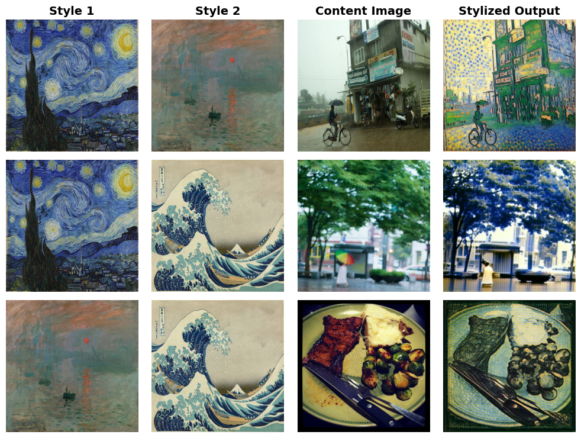

# StyleDiffusion Reproduction

Recreation of the Style Diffusion research paper from ICCV 2023. [Paper link](https://arxiv.org/abs/2308.07863). 

### Setup Instructions

1. Clone the repository

```
git clone https://github.com/ntu-ai-group-10/style_diffusion_reproduction.git
cd style_diffusion_reproduction
```

2. Create environment

```
conda create -n style_diffusion_reproduction python=3.9
conda activate style_diffusion_reproduction
conda install pytorch torchvision torchaudio pytorch-cuda=12.1 -c pytorch -c nvidia
pip install -r requirements.txt
pip install git+https://github.com/openai/CLIP.git
```

3. Prepare dataset

```
python src/prepare_dataset.py --n_content 50 --size 512
```

4. Prepare pre-trained model from [OpenAI Guided Diffusion](https://github.com/openai/guided-diffusion?tab=readme-ov-file)

```
git clone https://github.com/openai/guided-diffusion.git
cd guided-diffusion
pip install -e .
```

5. Download model checkpoints

```
cd models/checkpoints
wget https://openaipublic.blob.core.windows.net/diffusion/jul-2021/256x256_diffusion_uncond.pt
wget https://openaipublic.blob.core.windows.net/diffusion/jul-2021/512x512_diffusion.pt
```

### How to Run

1. Set up the run configurations in the `configs/` folder

2. Run `main.py`

```
python main.py --config configs/default.yaml
```

### Sample Output


### Sample Output with Style Mix

